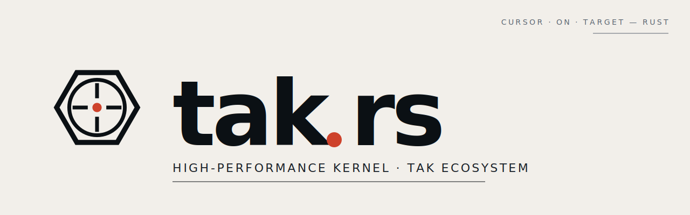

<p align="center">
  
</p>

# tak-rs

A high-performance Rust kernel for the [TAK (Team Awareness Kit)](https://tak.gov)
ecosystem. Drop-in replacement for the messaging core of the upstream Java
[TAK Server](https://github.com/TAK-Product-Center/Server), optimized for
single-node deployments at 10k+ concurrent mTLS streaming clients.

## Status

Pre-M0. Scaffold only.

## Layout

```
crates/
  tak-cot     — Cursor-on-Target codec (XML + protobuf TAK Protocol v1)
  tak-proto   — generated protobuf types (vendored from upstream)
  tak-net     — tokio listeners (TCP / TLS / UDP / multicast / QUIC)
  tak-bus     — subscription registry + fan-out (the firehose core)
  tak-store   — Postgres + PostGIS persistence
  tak-mission — Mission API (axum + tower)
  tak-config  — CoreConfig.xml subset parser
  tak-server  — binary
  taktool     — CLI (replay, sub, pub, fuzz)
```

## Read these first

- `CLAUDE.md` — entry-point doctrine; loaded automatically.
- `docs/architecture.md` — full design with Java→Rust component map.
- `docs/personas.md` — engineers we model on.
- `docs/invariants.md` — non-negotiable rules (correctness, hot path, discipline).

## Common workflows

```sh
cargo nextest run --workspace        # tests
cargo bench --bench firehose          # hot-path bench
cargo deny check                      # dep policy gate
cargo clippy --workspace -- -D warnings
```

Slash commands (in Claude Code):

- `/proto-sync` — pull `.proto` from upstream, regenerate
- `/bench-hot` — run firehose bench, diff vs baseline
- `/check-invariants` — full gauntlet
- `/fuzz-codec` — cargo-fuzz round
- `/replay-pcap <file>` — replay a capture through the server

## License

MIT OR Apache-2.0.
